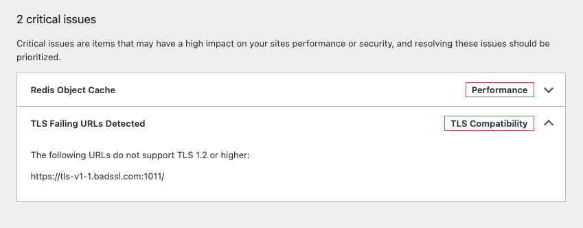

# WP TLS Compatibility Checker

[](https://docs.pantheon.io/oss-support-levels#unofficial-support)
[](https://github.com/jazzsequence/wp-tls-compatibility-checker/actions/workflows/lint.yml)


A scanner for outgoing HTTP requests in WordPress code to check TLS 1.2/1.3 compatibility.

## Installation

### Via Composer

```bash
composer require jazzsequence/wp-tls-compatibility-checker
```

### Via Git Updater

WP TLS Compatibility Checker supports [Andy Fragen's Git Updater](https://git-updater.com) method of managing plugins. 

1. Download and install [Git Updater](https://git-updater.com/git-updater/) on your WordPress site.
1. From the Git Updater admin pages, navigate to **Install Plugin** and use the following values:

**Plugin URI:** `jazzsequence/wp-tls-compatibility-checker`  
**Repository Branch:** `main`  
**Remote Repository Host:** `GitHub`  
**GitHub Access Token:** (optional, leave blank)

### Manually

1. Download the [latest release on GitHub]([https://](https://github.com/jazzsequence/wp-tls-compatibility-checker/releases).
1. Unzip the archive into your WordPress plugins directory (usually `/wp-content/plugins/`).
1. Upload the plugin to your WordPress site.
1. Activate the plugin.

## Usage

There are two ways to use the TLS Checker: via the WordPress admin or via WP-CLI. The plugin adds a new TLS Compatibility page to the Tools menu. This page allows you to run a TLS scan on your site against `/wp-content` and all subdirectories. When the scan is complete, a list of URLs that are not compatible with TLS 1.2 or higher will be displayed.


You can also run the scan using the [WP-CLI command described below](#wp-cli-commands). WP-CLI allows you to specify directories to scan, and to output the results in different formats (table, JSON, CSV, or YAML).

In either case, both _passing_ and _failing_ urls are stored to the database. Subsequent scans will automatically _skip_ the TLS check for URLs that are known to have passed previously (while still testing URLs that were previously failing). This data can be reset at any time either by using the `tls-checker reset` command from WP-CLI or in the admin with the "Reset TLS Compatibility Data" button.

After a scan has been run, if there are any URLs detected that fail the TLS 1.2/1.3 check, an alert will be displayed on your Site Health page with a list of the failing URLs.



## Filters

The TLS Compatibility Checker plugin contains two filters that can be used to either explicitly _add URLs to scan_ or _exclude URLs from scanning_.

### `pantheon.tls_checker.skip_urls`

This filter can be used to _exclude URLs from scanning_. The filter accepts an array of URLs to skip. For example:

```php
add_filter( 'pantheon.tls_checker.skip_urls', function( $skip_urls ) {
	$skip_urls[] = 'https://example.com';
	return $skip_urls;
} ) ;
```

### `pantheon.tls_checker.additional_urls`

This filter can be used to _add URLs to scan_. The filter accepts an array of URLs to add. For example:

```php
add_filter( 'pantheon.tls_checker.additional_urls', function( $additional_urls ) {
	$additional_urls[] = 'https://example.com';
	return $additional_urls;
} ) ;
```

## Extending the plugin

All the functions in [`inc/core.php`](blob/main/inc/core.php) are globally declared, allowing you to use any of them in your own code.

## WP-CLI Commands

The TLS Checker can be run from the command line with WP-CLI.

### `run`

Runs the TLS checker scan across all PHP files in the given directories (defaults to `/mu-plugins`, `/themes` and `/plugins`). You can specify a directory by passing a `--directory` flag, e.g.:

```bash
wp tls-checker run --directory=/path/to/my/directory
```

#### Examples

```bash
wp tls-checker scan
```

```bash
wp tls-checker scan --directory=/private/scripts/quicksilver
```

Or, in a Pantheon environment using Terminus:

```bash
terminus wp -- <site>.<env> tls-checker scan
```

### `report`

Returns a full report of checked URLs and whether they passed or failed the TLS check. Supports multiple formats (table, JSON, CSV, YAML).

#### Examples

```bash
wp tls-checker report
```

```bash
wp tls-checker report --format=json | jq
```

```bash
wp tls-checker report --format=csv
```

Or, in a Pantheon environment using Terminus:

```bash
terminus wp -- <site>.<env> tls-checker report
```

### `reset`

Resets the stored passing and failing URLs so the next scan will re-check all discovered URLs.

#### Examples
```bash
wp tls-checker reset
```

```bash
terminus wp -- <site>.<env> tls-checker reset
```

## How do I know it worked?
If the scan doesn't find anything bad, you should be good to go. If it does, it will list the URLs that it found that weren't compatible. However, if you want to validate that it's working, you can create a new plugin with the following code:

```php
<?php
/**
 * Plugin Name: TLS checker bad plugin
 * Description: Makes a request against a known bad (non-TLS 1.2+) URL
 * Version: 1.3
 * Author: Pantheon Systems
 */
add_action( 'admin_init', function() {
	print_r( wp_remote_get( 'https://tls-v1-1.badssl.com:1011/' ) );
});
```

When you run the command, the URL above should be returned as a host that does NOT support TLS 1.2 or higher.

## TODO
- [ ] Add tests